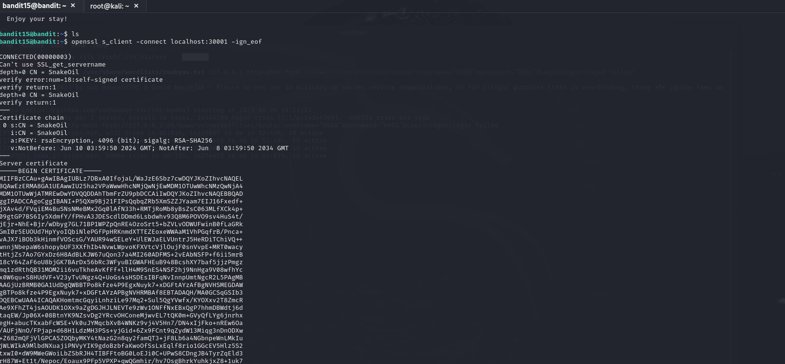

# Bandit CTF Challenge

This project documents my journey through the Bandit wargame by OverTheWire.  
Bandit is a beginner CTF (Capture The Flag) challenge focused on Linux basics, file enumeration, permissions, and security concepts.

## Tools Used:
- Kali Linux Terminal
- SSH
- Linux Commands (cat, ls, cd, chmod, find, etc.)

## Levels Completed:
- Level 0 ➔ Level 1
- Level 1 ➔ Level 2
- Level 2 ➔ Level 3
- (and so on...)

## Skills Gained:
- File system navigation
- Understanding file permissions
- Using SSH securely
- Finding hidden files
- Dealing with special characters in filenames
- Basic scripting and automation

## Screenshots:
| Level | Screenshot |
|-------|------------|
| Level 0 |  |
| Level 1 |  |
| Level 2 |  |

## Solutions:
- Check [solutions.txt](solutions.txt) for all commands used during the challenge.

---
**Note:** This project is for ethical learning purposes only.
